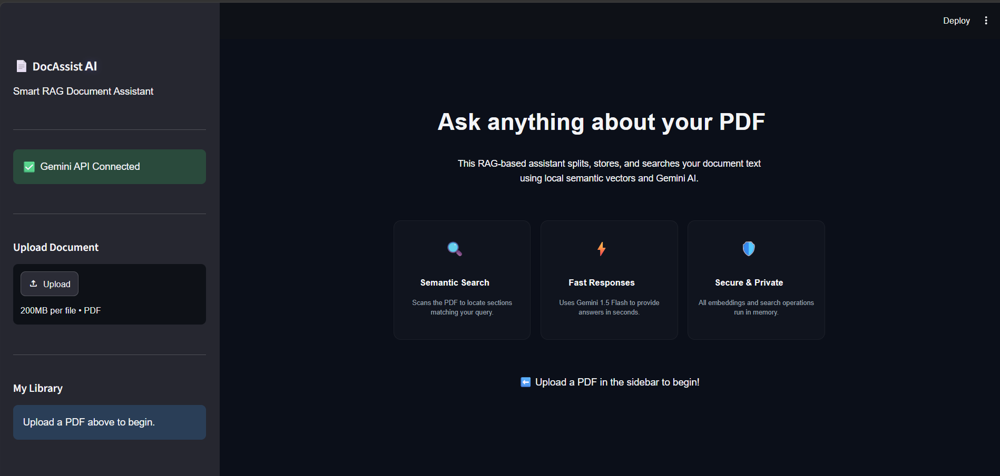
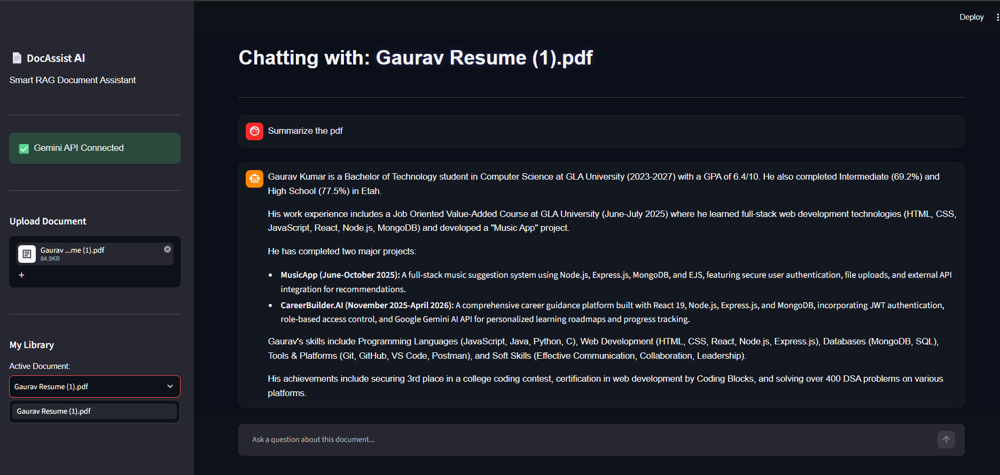

# 📄 DocAssist AI

DocAssist AI is a RAG (Retrieval-Augmented Generation) powered document assistant that enables users to upload PDF documents and ask questions about their content using Google's Gemini AI. The application extracts document text, creates semantic embeddings, and retrieves the most relevant information to generate accurate, context-aware responses.

---

# 🚀 Features

- 📄 Upload PDF documents
- 🤖 AI-powered document question answering
- 🔍 Semantic search using vector embeddings
- 💬 Interactive chat interface
- 📚 Document library management
- ⚡ Fast responses using Gemini AI
- 🔒 Secure local document processing
- 📂 Sidebar for uploaded document management

---

# 🛠️ Tech Stack

## Frontend

- Next.js
- TypeScript
- Tailwind CSS

## Backend

- FastAPI
- LangChain

## AI & RAG

- Google Gemini API
- LangChain
- FAISS Vector Store

## Libraries

- PyPDF2
- python-dotenv
- Uvicorn

---

# ⚙️ How It Works

1. Upload a PDF document.
2. Extract text from the uploaded PDF.
3. Split the text into smaller chunks.
4. Generate semantic embeddings.
5. Store embeddings in the local FAISS vector database.
6. Ask questions in natural language.
7. Retrieve the most relevant chunks.
8. Gemini AI generates answers based on the retrieved context.

---

# 📷 Application Screenshots

## Home Interface

The landing page where users can upload PDF documents and connect with the Gemini API.



---

## Chat Interface

After uploading a PDF, the application processes the document and opens an interactive chat interface. The uploaded document appears in the sidebar under the document library, allowing users to manage and query the selected file.



---

# 📁 Project Structure

```text
DOCASSIST/
│
├── backend/
│   ├── app/
│   │   ├── frontend/
│   │   │   ├── src/
│   │   │   ├── app.js
│   │   │   ├── index.html
│   │   │   └── style.css
│   │   │
│   │   ├── models/
│   │   ├── services/
│   │   ├── collection.py
│   │   ├── config.py
│   │   ├── database.py
│   │   └── main.py
│   │
│   └── requirements.txt
│── assets/
├── streamlit_app.py
├── requirements.txt
├── Dockerfile
├── .gitignore
└── README.md
```

---

# ⚙️ Installation

## Clone the Repository

```bash
git clone https://github.com/your-username/DocAssist-AI.git

cd DocAssist-AI
```

## Create Virtual Environment

```bash
python -m venv venv
```

### Windows

```bash
venv\Scripts\activate
```

### Linux / macOS

```bash
source venv/bin/activate
```

## Install Dependencies

```bash
pip install -r requirements.txt
```

---

## 🔑 Environment Variables

Create a `.env` file in the root directory.

```env
GOOGLE_API_KEY=YOUR_GEMINI_API_KEY
```

---

## ▶️ Run the Backend

```bash
cd backend/app

uvicorn main:app --reload
```

---

## ▶️ Run the Streamlit App

```bash
streamlit run streamlit_app.py
```

---

## 🎯 Future Enhancements

- 📑 Support for DOCX and TXT documents
- 💾 Persistent chat history
- 📌 Source highlighting
- 🌐 Multi-document querying
- ☁️ Cloud vector database integration
- 🔐 User authentication
- 📊 Analytics dashboard

---

## 🤝 Contributing

Contributions are welcome!

1. Fork the repository.
2. Create a feature branch.
3. Commit your changes.
4. Push the branch.
5. Open a Pull Request.

---
